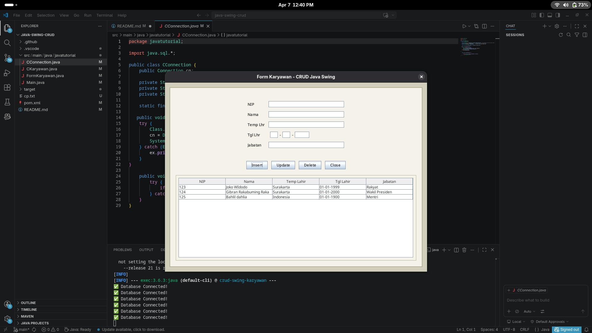

# DatabaseJava - Raddin Pratama Rachmat - i.2510152

Tugas pemrograman Java dengan integrasi basis data (database).

## Deskripsi
Program ini dibuat untuk mengelola data [karyawan] menggunakan bahasa pemrograman Java dan MySQL sebagai sistem manajemen basis datanya.

## Prasyarat
* Java JDK 8 atau versi terbaru.
* MySQL / XAMPP / LARAGON
* Apache Maven

## Struktur Proyek

```
crud-swing-karyawan/
├── pom.xml                          # Konfigurasi Maven
├── src/
│   └── main/
│       └── java/
│           └── javatutorial/
│               ├── Main.java         # Entry point aplikasi
│               ├── FormKaryawan.java # GUI utama (Swing)
│               ├── CKaryawan.java    # Model dan operasi database
│               └── CConnection.java  # Koneksi database
├── target/                          # Output kompilasi
└── README.md                        # Dokumentasi ini
```


## Konfigurasi
## Cara Menjalankan

### Metode 1: Menggunakan Maven (Recommended)
```bash
mvn compile exec:java
```

### Metode 2: Manual Compile dan Run
```bash
# Compile
mvn compile

# Run (Windows PowerShell / Copas semua dalam 1 line)
mvn -q dependency:build-classpath "-Dmdep.outputFile=cp.txt"
$cp = Get-Content .\cp.txt
java -cp "target\classes;$cp" javatutorial.Main

# Run (Linux/macOS)
java -cp target/classes:$(mvn dependency:build-classpath -Dmdep.outputFile=/dev/stdout -q) javatutorial.Main
```


## Hasil Screenshot
Berikut adalah hasil running program dan struktur databasenya:

### 1. Tampilan perogram 



---
*Dibuat oleh: Raddin Pratama Rachmat (i.2510152) - Mahasiswa ilmu komputer Universitas Djuanda.*